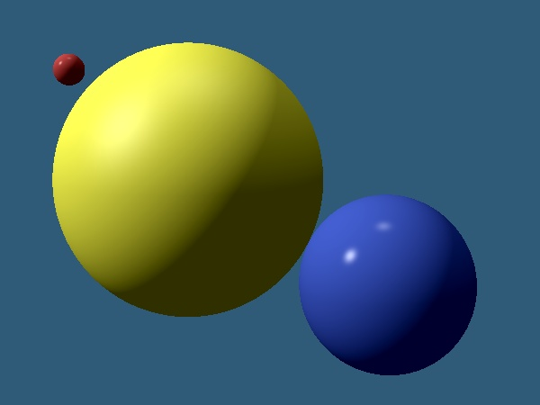

# Step08 - Ray casting image
* Your program should output Ray-casted HDR raster image according to
  simple scene definition.
* You have to put all the components together ([camera](../s04-Camera),
  [Solids](../s05-Solids), [BRDF, materials](../s06-BRDF) and
  [Lights](../s07-Light)) and implement simple "image synthesizer"
  to compute result image pixel-by-pixel.

# Checkpoint 2
I'll check your command-line program and try to modify your scene
to see what happens... At least two solids and two light sources
should be used in the scene.

# Sample
A sample scene with three spheres and two point light sources
is provided for reference: [scene definition](sample-scene.md).
You should get similar result if you use the same scene definition.

# Your Documentation
Use the [separate file DOC.md](DOC.md) to avoid merge conflicts.
