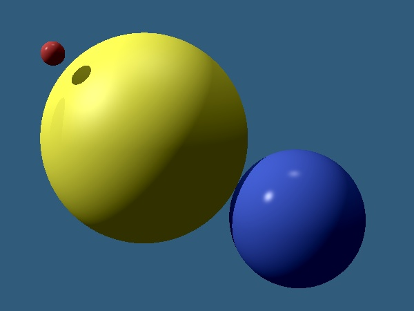

# Step10 - Shadows
* You have to include **simple ("sharp") shadows** computed
  by single shadow rays.

## Notes
* Nothing yet

## References
* Nothing yet

# Sample
A sample scene with three spheres and two point light sources
is provided for reference: [scene definition](../s08-ch2-RTimage/sample-scene.md).
You should get similar result if you use the same scene definition.

# Your Documentation
Use the [separate file DOC.md](DOC.md) to avoid merge conflicts.
