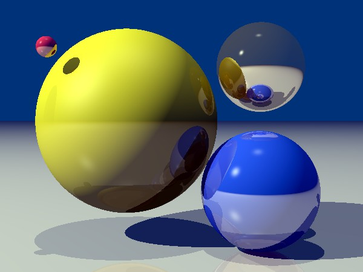

# Step11 - Recursive Ray-tracing with reflections
* You have to implement recursive Ray-tracing including **reflections**
  (no refractions are necessary yet)
* You have to use some suitable methods to limit the **depth of recursion**
  * simple `depth` counting could be sufficient
  * more advanced **ray performance** computation would lead to more efficient
    computation
  * you can combine both of the above approaches

# Checkpoint 3
I'll check your program, try to modify your scene description and check what happens...
At least one shiny material (perhaps together with diffuse ones) should be used in
the scene.

## Notes
* You may want to check your ray-solid intersection routines and think
  about handling **rays originating from the surface of the object!**
  * beware of numerical/rounding errors - the ray **must not intersect its own
    solid** at the origin point (`P0`)!
  * it's more about **"logic"** built on top of intersection functions...
* Don't forget to **reduce the light contribution of the reflection**
  (the reasonable multiplier should be something like `Ks` from Phong's BRDF - or
  Fresnel function if you want to be more precise)

## References
* **Reflected vector** computation - formula for unit vectors is
  [on the slide #5 of the BRDF slideshow](https://cgg.mff.cuni.cz/~pepca/lectures/pdf/prg-05-brdf.pdf)
* **Fresnel term** for unpolarized light -
  [slide #38 of the BRDF slideshow](https://cgg.mff.cuni.cz/~pepca/lectures/pdf/prg-05-brdf.pdf)
  (angle "beta" is our angle - between reflected/incoming vector and normal)
* **Approximate Fresnel term** (by Ch. Schlick) -
  [slide #55 of the BRDF slideshow](https://cgg.mff.cuni.cz/~pepca/lectures/pdf/prg-05-brdf.pdf)

# Samples
A sample scene with four spheres, one infinite plane, and two point light sources
is provided for reference: [scene definition](sample-scene.md).
You should get similar result if you use the same scene definition.

A sample scene with nine spheres, and one infinite plane:
[scene definition frustum](sample-scene-frustum.md). Very wide viewing angle (120&deg;
horizontally) causes extreme perspective distortion near image border.
You should get similar result if you use the same scene definition.

# Your Documentation
Use the [separate file DOC.md](DOC.md) to avoid merge conflicts.
